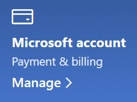

# Thay đổi thông tin tài khoản Microsoft của tôiChange my Microsoft account information

Đi đến [https://account.microsoft.com](https://account.microsoft.com/) và đăng nhập nếu cần.Go to [https://account.microsoft.com](https://account.microsoft.com/) and sign in if necessary. Việc này sẽ đưa bạn đến bảng điều khiển tài khoản của bạn.This will take you to your account dashboard.  

**Sửa tên và thông tin cá nhân của tôi****Edit my name and personal information**

1. Trên bảng điều khiển tài khoản của bạn, bên cạnh ảnh và tên tài khoản của bạn, hãy bấm **Thêm hành động > chỉnh sửa hồ sơ**.On your account dashboard, next to your account picture and name, click **More actions > Edit profile**.
2. Trên trang **sửa hồ sơ** , sử dụng các nối kết được cung cấp để thay đổi ảnh hồ sơ của bạn, tên, ngày sinh, vị trí và tùy chọn ngôn ngữ hiển thị.On the **Edit profile** page, use the links provided to change your profile picture, name, date of birth, location, and display language preference. Lưu ý các liên kết đến hồ sơ tài khoản Xbox hoặc Skype của bạn, nơi bạn có thể thay đổi các chi tiết cụ thể cho các tài khoản này.Note the links to your Xbox or Skype account profiles, where you can change details specific to these accounts.

**Quản lý địa chỉ email và số điện thoại****Manage e-mail addresses and phone numbers**

Tài khoản Microsoft có một hoặc nhiều địa chỉ email hoặc số điện thoại được liên kết với nó như "biệt danh".A Microsoft account has one or more e-mail addresses or phone numbers associated with it as “aliases.” Để quản lý những điều này:To manage these:

1. Trên bảng điều khiển tài khoản của bạn, bên cạnh ảnh và tên tài khoản của bạn, hãy bấm **Thêm hành động > chỉnh sửa hồ sơ**.On your account dashboard, next to your account picture and name, click **More actions > Edit profile**.
2. Trên trang **sửa hồ sơ** , bấm vào **quản lý cách bạn đăng nhập vào Microsoft**.On the **Edit profile** page, click **Manage how you sign in to Microsoft**. 
3. Bạn sẽ thấy danh sách biệt danh tài khoản và bạn có thể quản lý danh sách, bao gồm thêm và xóa địa chỉ email và số điện thoại.You will see a list of account aliases, and you can manage the list, including adding and deleting e-mail addresses and phone numbers. Tại đây, bạn cũng có thể chọn những bí danh nào có thể dùng để đăng nhập vào tài khoản và bí danh được xem là "chính", sẽ được hiển thị trên thiết bị chạy Windows 10 của bạn.Here you can also select which aliases can be used to sign in to the account, and which alias is considered “primary,” which will be displayed on your Windows 10 devices.

**Quản lý các phương thức thanh toán, cũng như tên và địa chỉ cho thanh toán****Manage payment methods, as well as name and address for billing** 

1. Trên bảng điều khiển tài khoản của bạn, bên cạnh ảnh và tên tài khoản của bạn, hãy bấm **Thêm hành động > chỉnh sửa hồ sơ**.On your account dashboard, next to your account picture and name, click **More actions > Edit profile**.
2. Bên dưới **thanh toán &** thanh toán bấm **quản lý**.Under **Payment & billing** click **Manage**.

    

3. Tại đây bạn có thể thêm, chỉnh sửa và loại bỏ các phương thức thanh toán và địa chỉ thanh toán liên kết.Here you can add, edit, and remove payment methods and their associated billing addresses. 
