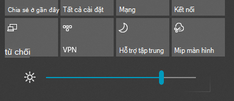

# Thay đổi độ sáng màn hình trong Windows 10Change screen brightness in Windows 10

Nếu Windows 10 của bạn mới hơn phiên bản 1903, nó có con **trượt độ sáng** trong Trung tâm hành động.If your Windows 10 is newer than version 1903, it has a **Brightness slider** in the action center. Để mở Trung tâm hành động, hãy bấm vào nút **thông báo** ở phía ngoài cùng bên phải của thanh tác vụ hoặc nhấn **Windows Home + A** trên bàn phím của bạn.To open the action center, click the **Notification** button at the rightmost side of your taskbar, or press **Windows home + A** on your keyboard.

Nếu Windows 10 của bạn là một phiên bản cũ hơn, bạn có thể tìm thấy các con trượt độ sáng bằng cách đi đến **[thiết đặt > hệ thống > Hiển thị](ms-settings:display?activationSource=GetHelp)**.If your Windows 10 is an earlier version, you can find the brightness slider by going to **[Settings > System > Display](ms-settings:display?activationSource=GetHelp)**.

**Ghi chú**:**Notes**:

- Bạn có thể không nhìn thấy độ sáng thay đổi cho màn hình hiển thị tích hợp sẵn trên máy tính để bàn có màn hình bên ngoài.You might not see the Change brightness for the built-in display slider on desktop PCs that have an external monitor. Để thay đổi độ sáng của màn hình bên ngoài, hãy dùng điều khiển trên màn hình.To change the brightness of an external monitor, use the controls on the monitor.
- Nếu bạn không có máy tính để bàn và con trượt không xuất hiện hoặc làm việc, hãy thử Cập Nhật trình điều khiển hiển thị.If you don't have a desktop PC and the slider doesn't appear or work, try updating the display driver. Trong hộp tìm kiếm trên thanh tác vụ, nhập **trình quản lý thiết bị**, rồi chọn **trình quản lý thiết bị** từ danh sách kết quả.In the search box on the taskbar, type **Device Manager**, and then select **Device Manager** from the list of results. Trong **trình quản lý thiết bị**, chọn **Hiển thị adapter**, sau đó chọn bộ điều hợp Hiển thị.In **Device Manager**, select **Display adapters**, then select the display adapter. Nhấn và giữ (hoặc bấm chuột phải) vào tên bộ điều hợp Hiển thị, rồi bấm vào **Cập Nhật trình điều khiển**; sau đó làm theo hướng dẫn.Press and hold (or right-click) the display adapter name and click **Update driver**; then follow the instructions.
