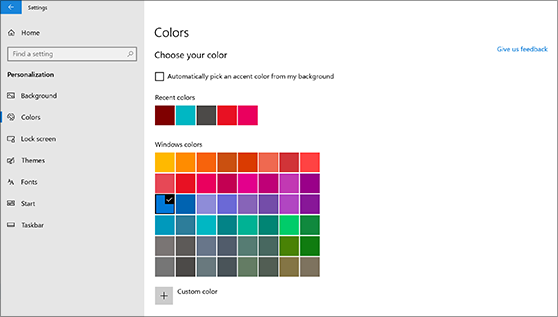
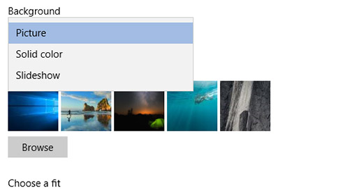

# Thay đổi nền và màu nền trên màn hình nền của bạn

Để thay đổi thiết đặt màu của bạn, hãy đi đến mục **bắt đầu**các màu cá nhân hóa  >  **cài đặt**  >  **Personalization**  >  **Colors**, rồi chọn màu của riêng bạn hoặc để Windows kéo một màu giọng nói từ nền của bạn.

Để thay đổi nền màn hình nền của bạn, hãy đi đến mục **bắt đầu**  >  **cài đặt**  >  **cá**nhân hóa  >  **nền**, rồi chọn ảnh, màu thuần hoặc tạo trình chiếu ảnh. 

Bạn muốn có thêm nền và màu khác? Truy nhập [Microsoft Store](https://www.microsoft.com/store/collections/windowsthemes) để chọn từ hàng chục chủ đề miễn phí.
