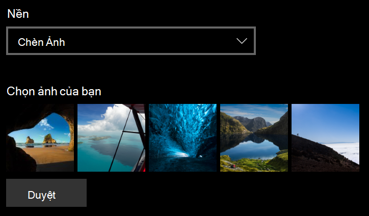
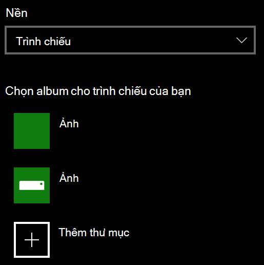

# Thay đổi nền màn hình khóa của bạn

- Đi đến   >    >  **màn hình khóa** cá nhân hóa cài đặt. Hoặc bấm hoặc nhấn vào [đây](ms-settings:lockscreen?activationSource=GetHelp).

- Để thiết lập một ảnh nền tùy chỉnh, hãy chọn **ảnh** từ danh sách thả xuống **nền** , rồi chọn hoặc **duyệt** đến ảnh.

  

- Để thiết lập trình chiếu ảnh tùy chỉnh, hãy chọn **slideshow** từ danh sách thả xuống **nền** , rồi chọn một album hoặc thêm một thư mục có chứa ảnh cho trình chiếu.

  
