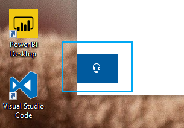

# Liên hệ với chúng tôi bằng cách nhấp vào nút tai ngheContact us by clicking the headphone button

Nếu bạn muốn liên hệ với Microsoft support, vui lòng nhấp vào **liên hệ với chúng tôi** ở góc dưới bên trái của ứng dụng này.If you'd like to contact Microsoft Support, please click **Contact us** in the lower left corner of this app. Bên trong cửa sổ Fly-out, bạn sẽ được hướng dẫn đến kênh hỗ trợ đúng sau khi chọn danh mục sản phẩm và vấn đề của bạn.Inside the fly-out window, you will be guided to the right support channel after choosing your product and issue category.

Bạn có thể tiếp tục tương tác với phần còn lại của ứng dụng ngay cả sau khi bạn đã bắt đầu một phiên liên hệ với chúng tôi.You can keep interacting with the rest of the app even after you have initiated a Contact us session. Bảng liên hệ chúng tôi có thể tạm thời thu nhỏ bằng cách nhấp vào bất kỳ nơi nào khác bên trong ứng dụng.The Contact us panel can be temporarily minimized by clicking anywhere else inside the app. Để trở về cùng một phiên, chỉ cần nhấp vào **liên hệ với chúng tôi** một lần nữa.To return to the same session, just click **Contact us** again.
