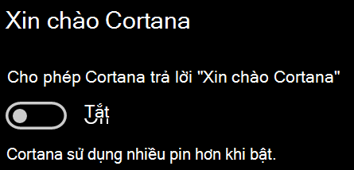

# Cortana không nói chuyện với tôi hoặc không thể nghe thấy tôiCortana doesn’t talk to me or can’t hear me

Nếu bạn đang cố sử dụng tính năng "Xin chào Cortana", cho phép bạn nói chuyện với Cortana mà không chọn nút Cortana trên thanh tác vụ hoặc nút micrô trong bảng điều khiển Cortana, hãy xác nhận rằng tính năng này được bật:If you are trying to use the "Hey Cortana" feature, which allows you to talk to Cortana without selecting the Cortana button on the taskbar or the microphone button in the Cortana panel, confirm that the feature is enabled:

1. Đi tới **bắt đầu**, rồi chọn **[cài đặt > Cortana](ms-settings:cortana?activationSource=GetHelp)**.Go to **Start**, then select **[Settings > Cortana](ms-settings:cortana?activationSource=GetHelp)**.
2. Trong **Hey Cortana**, hãy chuyển đổi **cho phép Cortana trả lời "Xin chào Cortana"** để **bật.**Under **Hey Cortana**, switch the **Let Cortana respond to "Hey Cortana"** toggle to **On**.

**Cài đặt quyền riêng tư của bạn có ngăn không cho Cortana nghe không?****Are your privacy settings preventing Cortana from hearing you?**

Cài đặt quyền riêng tư của bạn có thể ngăn Cortana phản hồi giọng nói của bạn.Your privacy settings can prevent Cortana from responding to your voice.
- Kiểm tra để đảm bảo đã bật tính năng nhận dạng giọng nói trực tuyến:Check to make sure Online Speech recognition is turned on:
    - Đi tới **bắt đầu**, sau đó nhấp vào **[cài đặt > quyền riêng tư > giọng nói](ms-settings:privacy-speech?activationSource=GetHelp)**.Go to **Start**, then click **[Settings > Privacy > Speech](ms-settings:privacy-speech?activationSource=GetHelp)**.
    - Trong phần **nhận dạng giọng nói trực tuyến**, hãy chuyển cài đặt thành **bật**.Under **Online speech recognition**, switch the setting to **On**.
- Kiểm tra để đảm bảo Cortana có quyền truy nhập micrô của bạn.Check to make sure Cortana has permission to access your microphone. 
    - Chuyển đến bắt đầu, sau đó nhấp vào **[cài đặt > quyền riêng tư > micrô](ms-settings:privacy-microphone?activationSource=GetHelp)**.Go to Start, then click **[Settings > Privacy > Microphone](ms-settings:privacy-microphone?activationSource=GetHelp)**.
    - Trong **chọn các ứng dụng có thể truy nhập vào micrô của bạn**, hãy tìm **Cortana** trong danh sách ứng dụng và dịch vụ và đảm bảo rằng **nút chuyển được bật.**Under **Choose which apps can access your microphone**, look for **Cortana** within the list of apps and services and make sure the switch is toggled to **On**.

Hơn nữa, vui lòng cũng đảm bảo rằng loa hoặc micrô của bạn đang hoạt động và làm việc để nói chuyện với Cortana.Moreover, please also make sure that your speakers or microphones are up and working in order to talk to Cortana.
