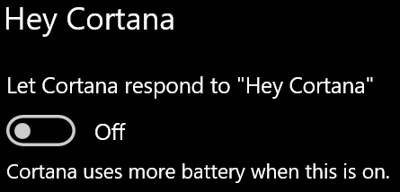

# Cortana không nói chuyện với tôi hoặc không thể nghe thấy tôi

Nếu bạn đang tìm cách sử dụng tính năng "Xin chào Cortana", tính năng này cho phép bạn trò chuyện với Cortana mà không cần chọn nút Cortana trên thanh tác vụ hoặc nút micrô trong pa-nen Cortana, hãy xác nhận rằng tính năng được bật:

1. Đi tới **Bắt đầu**, sau đó **[chọn Cài đặt > Cortana](ms-settings:cortana?activationSource=GetHelp)**.
2. Trong **Xin Cortana**, hãy chuyển nút bật tắt Cho Cortana phản hồi **"Xin Cortana"** thành **Bật**.

**Cài đặt quyền riêng tư của bạn có ngăn Cortana khi nghe bạn không?**

Cài đặt quyền riêng tư của bạn có thể Cortana phản hồi giọng nói của bạn.
- Kiểm tra để đảm bảo nhận dạng Giọng nói trực tuyến đã được bật:
    - Đi tới Bắt **đầu**, sau đó bấm vào Lời **[Cài đặt > quyền riêng > Giọng nói](ms-settings:privacy-speech?activationSource=GetHelp)**.
    - Trong **Nhận dạng giọng nói** trực tuyến , chuyển cài đặt thành **Bật**.
- Hãy kiểm tra để đảm bảo Cortana có quyền truy cập vào micrô của bạn. 
    - Đi tới Bắt đầu, rồi bấm vào Xem **[Cài đặt > Quyền riêng > Micrô.](ms-settings:privacy-microphone?activationSource=GetHelp)**
    - Trong Chọn ứng dụng có thể truy nhập **micrô** của bạn , hãy tìm **kiếm ứng Cortana** trong danh sách ứng dụng và dịch vụ và đảm bảo nút chuyển đã được bật thành **Bật**.

Ngoài ra, vui lòng đảm bảo rằng loa ngoài hoặc micrô của bạn đang ở trên và làm việc để trò chuyện cùng Cortana.
