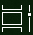

# Thực hiện nhiều việc hơn với đa nhiệm trong Windows 10Do more with multitasking in Windows 10

Để xem hoặc chuyển đổi giữa các ứng dụng: bạn có thể bấm vào nút **dạng xem tác vụ** trong thanh tác vụ hoặc nhấn **Alt-Tab** trên bàn phím của bạn.To see or switch between apps: you can click the **Task View** button in the taskbar, or press **Alt-Tab** on your keyboard. Nút dạng xem tác vụ trông như thế này:The Task View button looks like this:

Để dễ dàng sắp xếp hai ứng dụng cạnh nhau, hãy sử dụng snap Assist: lấy đầu cửa sổ ứng dụng và kéo nó sang một bên để "đính" nó vào một nửa của màn hình.To easily arrange two apps side by side, use Snap Assist: grab the top of an app window and drag it to one side to "snap" it to that half of the screen. Sau đó, chọn một ứng dụng khác và nó sẽ tự động đính vào vị trí trong nửa kia của màn hình.Then choose another app and it will automatically snap into place in the other half of the screen.

**Để tạo máy tính bàn ảo khác nhau cho gia đình và công việc**:**To create different virtual desktops for home and work**:

1. Bấm vào nút **dạng xem tác vụ** trong thanh tác vụ hoặc nhấn **Alt-Tab** trên bàn phím của bạn.Click the **Task View** button in the taskbar, or press **Alt-Tab** on your keyboard.
2. Bấm **+ máy tính để bàn mới** (nằm ở góc trên bên trái màn hình của bạn khi ở trong dạng xem tác vụ).Click **+ New Desktop** (located at the top left of your screen while in task view).
3. Mở ứng dụng bạn muốn sử dụng.Open the apps you want to use. 

Quay lại **dạng xem tác vụ** để xem máy tính để bàn của bạn và chuyển đổi giữa chúng.Go back to **Task View** to see your desktops and switch between them.
