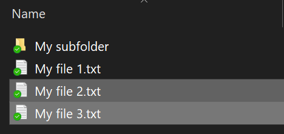
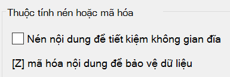

# Mã hóa tệp hoặc thư mục trong Windows 10

Bạn có thể mã hóa toàn bộ ổ đĩa bằng BitLocker, nhưng chỉ để mã hóa các tệp hoặc thư mục riêng lẻ (và nội dung của chúng):

1. Trong **File Explorer**, chọn (các) tệp/thư mục bạn muốn mã hóa. Trong ví dụ này, hai tệp đã được chọn:

    

2. Bấm chuột phải vào tệp đã chọn và bấm Thuộc **tính.**

3. Trong cửa sổ **Thuộc** tính, bấm Nâng **cao.**

4. Trong cửa sổ **Thuộc tính Nâng** cao, chọn hộp kiểm Mã hóa nội dung để bảo mật **dữ** liệu:

    

5. Bấm **OK**.
