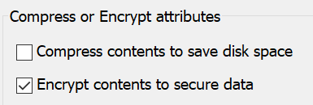

# Mã hóa tệp hoặc thư mục trong Windows 10Encrypt files or folder in Windows 10

Bạn có thể mã hóa toàn bộ một đĩa bằng BitLocker, nhưng chỉ mã hóa các tệp hoặc thư mục riêng lẻ (và nội dung của chúng):You can encrypt an entire disk using BitLocker, but to encrypt only individual files or folders (and their contents):

1. Trong **file Explorer**, chọn (các) tệp/thư mục bạn muốn mã hóa.In **File Explorer**, select the file(s)/folder(s) you want to encrypt. Trong ví dụ này, hai tệp đã được chọn:In this example, two files have been selected:

    

2. Bấm chuột phải vào tệp đã chọn và bấm **thuộc tính**.Right-click the selected files and click **Properties**.

3. Trong cửa sổ **thuộc tính** , bấm **nâng cao**.In the **Properties** window, click **Advanced**.

4. Trong cửa sổ **thuộc tính nâng cao** , chọn hộp kiểm **mã hóa nội dung để bảo mật dữ liệu** :In the **Advanced Properties** window, select the **Encrypt contents to secure data** checkbox:

    

5. Bấm **OK**.Click **OK**.
