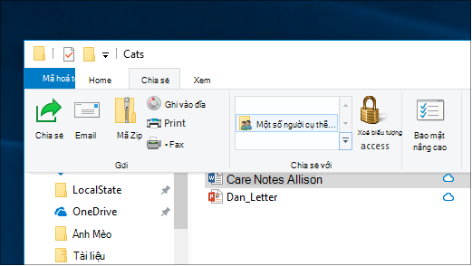
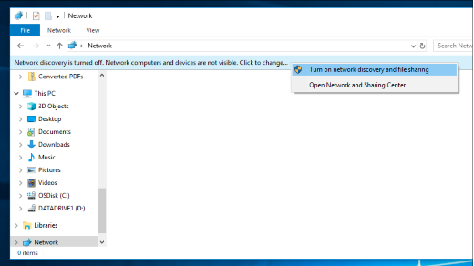

# Chia sẻ tệp qua mạng trong cơ Windows 10

**Lưu** ý : Nếu trước đây bạn đã sử dụng Nhóm Gia đình để chia sẻ tệp, vui lòng lưu ý rằng Nhóm Gia đình đã bị loại bỏ khỏi nhóm Windows 10 (Phiên bản 1803). Giờ đây, bạn có thể chia sẻ máy in và tệp bằng các tính năng tích hợp sẵn trong Windows 10.

**Để chia sẻ tệp hoặc thư mục qua mạng**

- Trong **File Explorer**, chọn một tệp ở > bấm vào tab Chia sẻ ở phía trên cùng > trong mục Chia sẻ với, bấm vào Những người cụ **thể.**  

    
          
- Nếu bạn chọn nhiều tệp cùng một lúc, bạn có thể chia sẻ tất cả chúng theo cùng một cách. Nó cũng có thể hoạt động với các thư mục.

**Để xem các thiết bị trên mạng đang chia sẻ tệp**

- Trong **File Explorer**, đi tới **Mạng**. Nếu Khám phá mạng không được bật, bạn sẽ thấy thông báo lỗi "Khám phá mạng đã tắt..."

- Bấm vào **biểu ngữ Khám phá mạng đã tắt,** sau đó bấm Bật khám phá mạng và chia sẻ **tệp.**

    

[Đọc thêm về chia sẻ tệp qua mạng](https://support.microsoft.com/help/4092694/windows-10-file-sharing-over-a-network)

[Chia sẻ tệp bằng ứng dụng, OneDrive, email và hơn thế nữa](https://support.microsoft.com/help/4027674/windows-10-share-files-in-file-explorer)
