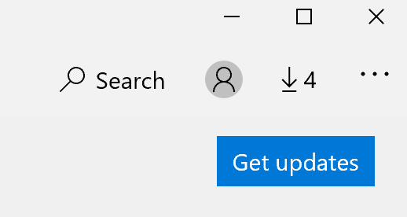

# Sửa ngôn ngữ hiển thị của các ứng dụng

Sau khi bạn thay đổi ngôn ngữ hiển thị trong Windows 10, một số ứng dụng vẫn có thể sử dụng ngôn ngữ trước đó khi bạn mở chúng. Điều này xảy ra vì các phiên bản mới của ứng dụng cho ngôn ngữ đó phải được tải xuống từ cửa hàng. Để khắc phục sự cố này, bạn có thể chờ cập nhật tự động hoặc bạn có thể cài đặt phiên bản Cập Nhật của ứng dụng theo cách thủ công.

Để cài đặt bản Cập Nhật theo cách thủ công, hãy mở **Microsoft Store** , rồi bấm vào **tải xuống và Cập Nhật** ở góc trên cùng bên phải. Sau đó bấm **lấy bản Cập Nhật**. Nếu ngôn ngữ không được thay đổi sau khi hoàn tất Cập Nhật, hãy thử khởi động lại PC của bạn.

Để đọc thêm về các thiết đặt ngôn ngữ nhập và hiển thị, hãy xem [quản lý thiết đặt ngôn ngữ nhập và hiển thị của bạn trong Windows 10](https://support.microsoft.com/help/4027670/windows-10-add-and-switch-input-and-display-language-preferences).
