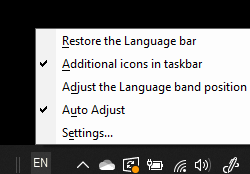

# Ẩn, Hiển thị hoặc đặt lại thanh ngôn ngữ

**Để giảm thiểu thanh ngôn ngữ:**

Bạn có thể bấm vào nút thu nhỏ cực tiểu ở góc trên bên phải của thanh ngôn ngữ. Hoặc, bạn chỉ có thể kéo thanh ngôn ngữ đến thanh tác vụ, điều này sẽ tự động thu nhỏ nó.

**Để bật thanh ngôn ngữ:**

Nếu bạn không muốn gắn thanh ngôn ngữ trong thanh tác vụ, hãy bấm chuột phải vào bất kỳ khoảng trống nào trong thanh tác vụ, rồi bỏ chọn tùy chọn **thanh ngôn ngữ** trong menu thanh công cụ. Thao tác này sẽ làm cho thanh ngôn ngữ xuất hiện bên ngoài thanh tác vụ, giống như ảnh chụp màn hình trước đó.

**Để khôi phục thanh ngôn ngữ thành mặc định:**

Bấm chuột phải vào nút ngôn ngữ trong thanh công cụ, rồi bấm vào **khôi phục tùy chọn thanh ngôn ngữ** trong menu. Điều này sẽ khôi phục nó vào mặc định.

