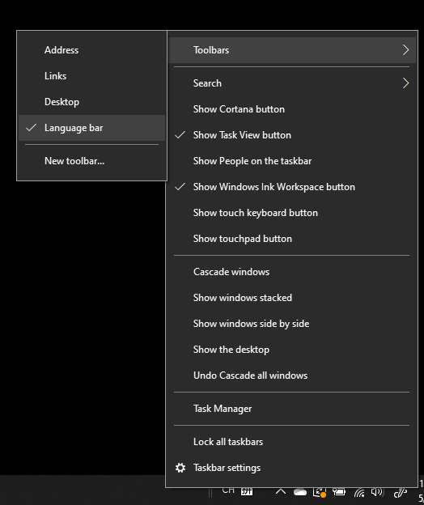

# Ẩn, Hiển thị hoặc đặt lại thanh ngôn ngữHide, display, or reset the language bar

**Để giảm thiểu thanh ngôn ngữ:****To minimize the language bar:**

Bạn có thể bấm vào nút thu nhỏ cực tiểu ở góc trên bên phải của thanh ngôn ngữ.You can click the minimize button on the top right corner of the language bar. Hoặc, bạn chỉ có thể kéo thanh ngôn ngữ đến thanh tác vụ, điều này sẽ tự động thu nhỏ nó.Or, you can just drag the language bar to the task bar, which will automatically minimize it.

**Để bật thanh ngôn ngữ:****To pop out the language bar:**

Nếu bạn không muốn gắn thanh ngôn ngữ trong thanh tác vụ, hãy bấm chuột phải vào bất kỳ khoảng trống nào trong thanh tác vụ, rồi bỏ chọn tùy chọn **thanh ngôn ngữ** trong menu thanh công cụ.If you don't want to dock the language bar in the taskbar, right-click any empty space in the taskbar, and uncheck the **Language bar** option in the Toolbars menu. Thao tác này sẽ làm cho thanh ngôn ngữ xuất hiện bên ngoài thanh tác vụ, giống như ảnh chụp màn hình trước đó.This will make the language bar appear outside the taskbar, just like the previous screenshot.

**Để khôi phục thanh ngôn ngữ thành mặc định:****To restore the language bar to default:**

Bấm chuột phải vào nút ngôn ngữ trong thanh công cụ, rồi bấm vào **khôi phục tùy chọn thanh ngôn ngữ** trong menu.Right-click the language button in the toolbar, and click **Restore the language bar** option in the menu. Điều này sẽ khôi phục nó vào mặc định.This will restore it to default.

