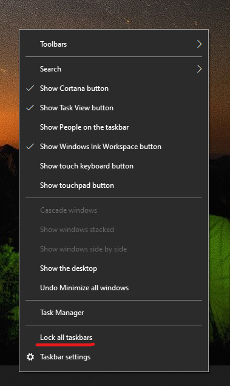

# Di chuyển thanh tác vụ sang một bên hoặc phía trên cùng của màn hình nền của bạn

Trước tiên, vui lòng xác nhận rằng thanh tác vụ đang được mở khóa. Để tìm hiểu xem bạn có đang mở khóa hay không, hãy bấm chuột phải vào bất kỳ khoảng trống nào trên thanh tác vụ và xem liệu có có dấu kiểm trên **thanh tác vụ** hay không, bên cạnh nó không. Nếu có dấu kiểm, thanh tác vụ đã bị khóa và không thể di chuyển được. Bấm vào **khóa thanh tác vụ** một lần sẽ mở khóa và loại bỏ dấu kiểm.

Nếu bạn có nhiều màn hình hiển thị thanh tác vụ, bạn sẽ thấy **khóa tất cả taskbars**.

Sau khi thanh tác vụ được mở khóa, bạn có thể nhấn và giữ bất kỳ khoảng trống nào trên thanh tác vụ và kéo nó đến vị trí bạn muốn trên màn hình. Bạn cũng có thể làm như vậy bằng cách bấm chuột phải vào bất kỳ khoảng trống nào trên thanh tác vụ và đi đến **[thiết đặt thanh tác vụ](ms-settings:taskbar?activationSource=GetHelp) > vị trí thanh tác vụ trên màn hình**.
