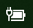

# Mất điện hoặc biểu tượng pin trong Windows 10Power or battery icon missing in Windows 10

Nếu thiết bị chạy Windows 10 của bạn có pin (ví dụ, máy tính xách tay hoặc máy tính bảng hoặc PC được kết nối qua cổng USB đến một UPS), thường là biểu tượng Power/Battery được hiển thị trong thanh tác vụ gần đồng hồ, ví dụ:If your Windows 10 device has a battery (e.g., laptop or tablet, or a PC connected via USB to a UPS), normally a power/battery icon is shown in the taskbar near the clock, for example:

Nếu bạn không nhìn thấy biểu tượng này, có thể bạn sẽ bị ẩn:If you don't see this icon, it may be hidden:

1. Đi đến **[cài đặt > thanh tác vụ > cá](ms-settings:taskbar?activationSource=GetHelp)** nhân hóa.Go to **[Settings > Personalization > Taskbar](ms-settings:taskbar?activationSource=GetHelp)**.

2. Trong khu vực thông báo, hãy bấm **chọn biểu tượng nào xuất hiện trên thanh tác vụ**.In the Notification area, click **Select which icons appear on the taskbar**.

3. Sau đó tìm mục **Power** trong danh sách và chuyển đổi thiết đặt thành **bật**.Then find the **Power** item in the list and toggle its setting to **On**.

    

**Giải****Troubleshooting**

Nếu bạn đã làm theo các hướng dẫn trên và bật tắt của **Power** sẽ bị mờ đi hoặc không nhìn thấy được, trong hộp tìm kiếm trên thanh tác vụ, hãy nhập **trình quản lý thiết bị**, rồi chọn **Device Manager** trong danh sách kết quả.If you followed the above instructions and the **Power** toggle is greyed out or not visible, in the search box on the taskbar, type **device manager**, and then select **Device Manager** in the list of results. Bên dưới **pin**, bấm chuột phải vào pin cho thiết bị của bạn, bấm vào **tắt**, rồi bấm **có**.Under **Batteries**, right-click the battery for your device, click **Disable**, and click **Yes**. Chờ vài giây, rồi bấm chuột phải vào pin và bấm **bật**.Wait a few seconds, and then right-click the battery and click **Enable**. Sau đó khởi động lại thiết bị của bạn.Then restart your device.

Nếu bạn đã làm theo các hướng dẫn ở trên, nhưng biểu tượng pin không xuất hiện trên thanh tác vụ, trong hộp tìm kiếm trên thanh tác vụ, hãy gõ **trình quản lý tác vụ**, rồi bấm **trình quản lý tác vụ** trong danh sách kết quả.If you followed the above instructions, but the battery icon does not appear on the taskbar, in the search box on the taskbar, type **task manager**, and then click **Task Manager** in the list of results. Trên tab **tiến trình** , bên dưới **tên**, hãy bấm chuột phải vào **Explorer**, rồi bấm vào **khởi động lại**.On the **Processes** tab, under **Name**, right-click **Explorer**, and then click **Restart**.
