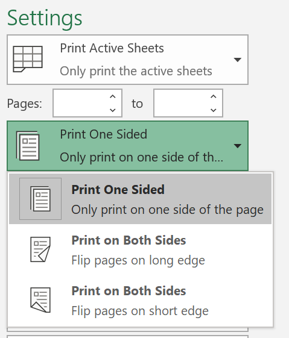
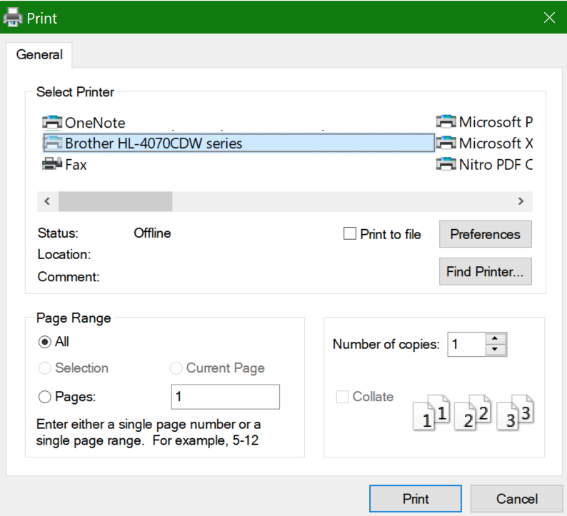

# In trên cả hai mặt giấy (in song)

**Máy in của tôi có khả năng in Duplex không?**

Tóm tắt hoặc thủ công về tính năng của máy in sẽ cho bạn biết liệu nó có khả năng in trên cả hai mặt của giấy hay không, còn được gọi là "in song." Nếu bạn có Microsoft Office, một cách khác để tìm hiểu là mở một ứng dụng Office như Word hoặc Excel, đi tới **tệp > in**, đảm bảo rằng máy in phù hợp được chọn và tìm kiếm khả năng trong phần cài đặt. Ví dụ: 

**Duplex in trong Microsoft Office**

Nếu máy in của bạn có khả năng in ở cả hai bên, khi bạn đi tới **tệp > in** trong ứng dụng Office, bạn sẽ thấy một tùy chọn để "in trên cả hai mặt" như được hiển thị trong ví dụ ở trên.  Chọn kiểu in Duplex bạn muốn (lật trên mép dài, hoặc lật trên mép ngắn) và nhấp vào in để bắt đầu bản **in** .

**Duplex in từ bất kỳ ứng dụng**

Trong nhiều ứng dụng khi bạn in, bạn sẽ thấy một hộp thoại in chung trông như thế này: 

Đảm bảo rằng máy in phải được chọn, sau đó bấm vào **tùy chọn** để mở cửa sổ tùy chọn máy in. Nếu máy in có khả năng in Duplex, khả năng kích hoạt điều này cho công việc in hiện tại sẽ hiển thị trong cửa sổ đó.
