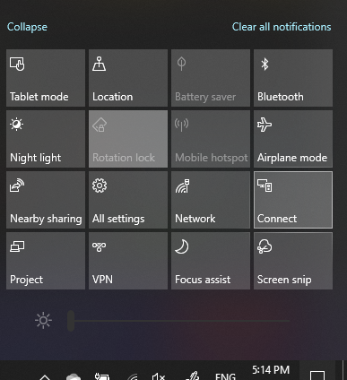

# Dự án đến máy PCProject to a PC

Trên thiết bị đích của bạn (dự định), tìm kiếm "cài đặt trình chiếu" để mở trang cài đặt của **chiếu tới PC này**.On your destination device (projecting to), search for "Projection Settings" to open the Settings page of **Projecting to this PC**. Sau đó, hãy chắc chắn rằng:Then make sure that:
- "Một số thiết bị Windows và Android có thể dự án máy tính này khi bạn nói đó là OK" trình đơn thả xuống được thiết lập để **luôn tắt**."Some Windows and Android devices can project to this PC when you say it's OK" drop-down menu is set to **Always Off**.
- Trình đơn thả xuống "yêu cầu dự án đến máy tính này" được đặt thành **mỗi lần kết nối được yêu cầu**."Ask to project to this PC" drop-down menu is set to **Every time a connection is required**.
- Trình đơn thả xuống "yêu cầu GHIM ghép nối" được đặt thành **không bao giờ**."Require PIN for pairing" drop-down menu is set to **Never**.

Trên thiết bị đích của bạn, hãy khởi chạy ứng dụng **kết nối** bằng tiến trình **bắt đầu** và tìm kiếm "kết nối".On your destination device, launch **Connect** app by going to **Start** and search for "Connect".

Sau đó, trên thiết bị nguồn mà bạn đang cố gắng dự án từ:Then, on your source device that you are trying to project from:

1. Nhấn **phím Windows + A** để mở Trung tâm hành động.Press **Windows key + A** to open Action Center.
2. Nhấp vào **kết nối**.Click **Connect**.
3. Nhấp vào thiết bị bạn muốn dự án màn hình.Click the device you want to project the screen to.

Sau khi các bước trên, thiết bị đích của bạn sẽ hiển thị màn hình của thiết bị nguồn như nếu nó là một màn hình phụ.After the above steps, your destination device should display the screen of the source device as if it is a secondary monitor.
