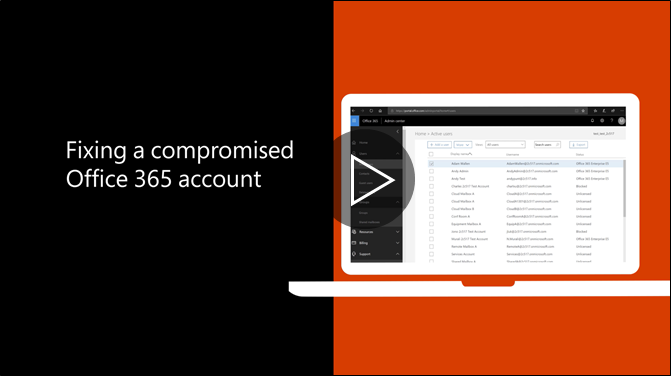

# Nên bước đi nếu tài khoản bị thỏa hiệpRecommended steps to take if an account is compromised

  
1. [Đặt lại mật khẩu của người dùng](https://support.office.com/article/7a5d073b-7fae-4aa5-8f96-9ecd041aba9c) ngay lập tức. Không phải liên lạc mật khẩu mới qua email cho người dùng cuối.[Reset the user's password](https://support.office.com/article/7a5d073b-7fae-4aa5-8f96-9ecd041aba9c) immediately. Do not communicate the new password through email to the end user. 
    
2. Loại bỏ bất kỳ nghi ngờ [chuyển tiếp địa chỉ](https://support.office.com/article/ab5eb117-0f22-4fa7-a662-3a6bdb0add74) đặt ở cấp hộp thư.Remove any suspicious [forwarding addresses](https://support.office.com/article/ab5eb117-0f22-4fa7-a662-3a6bdb0add74) set at the mailbox level. 
    
3. Loại bỏ bất kỳ nghi ngờ [quy tắc hộp thư đến](https://support.office.com/article/1433E3A0-7FB0-4999-B536-50E05CB67FED) trong hộp thư.Remove any suspicious [inbox rules](https://support.office.com/article/1433E3A0-7FB0-4999-B536-50E05CB67FED) set within the mailbox. 
    
4. Nếu người dùng bị chặn gửi thư điện tử, [đi tới những người dùng bị giới hạn để mở khóa các tài khoản](https://protection.office.com/?hash=/restrictedusers). Sau khi thực hiện, người dùng sẽ có thể tiếp tục gửi tin nhắn trong vòng 1 giờ.If the user is blocked from sending email, [go to the Restricted Users to unblock the account](https://protection.office.com/?hash=/restrictedusers). Once done, the user should be able to resume sending messages within 1 hour.
    
5. Loại bỏ trương mục người dùng từ bất kỳ [nhóm vai trò quản trị](https://support.office.com/article/eac4d046-1afd-4f1a-85fc-8219c79e1504) cho đến khi bạn đang tự tin rằng các tài khoản không còn bị tổn hại.Remove the user account from any [administrative role groups](https://support.office.com/article/eac4d046-1afd-4f1a-85fc-8219c79e1504) until you are confident that the account is no longer compromised. 
    
Để giảm thiểu các tiềm năng của một sự vi phạm dữ liệu hoặc một tài khoản bị tổn hại trong tương lai, chúng tôi khuyên bạn nên đọc [bài viết thực tiễn tốt nhất Office 365 bảo mật](https://support.office.com/article/9295e396-e53d-49b9-ae9b-0b5828cdedc3)của chúng tôi.To minimize the potential of a data breach or a compromised account in the future, we recommend reading our [Office 365 Security best practices article](https://support.office.com/article/9295e396-e53d-49b9-ae9b-0b5828cdedc3).
  

