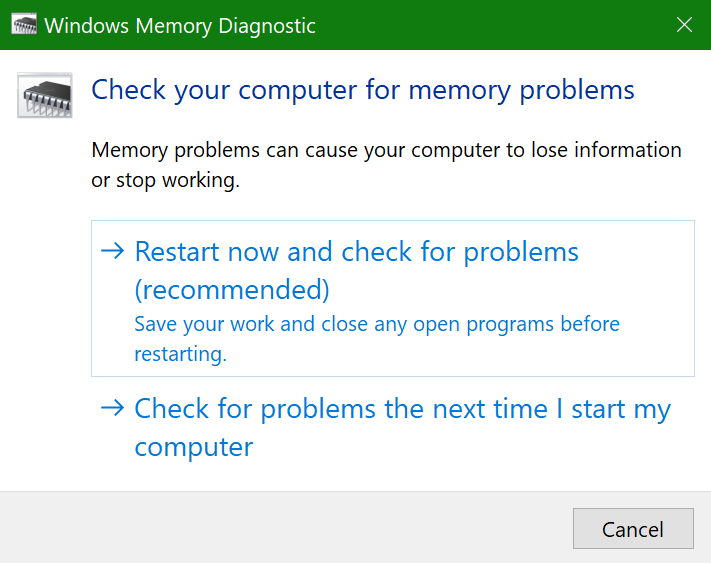
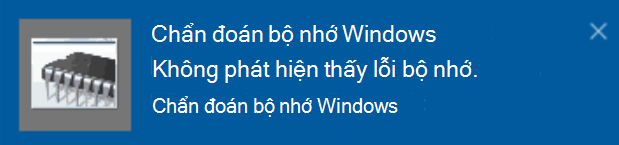

# Chạy chẩn đoán bộ nhớ Windows trong Windows 10Run Windows Memory Diagnostics in Windows 10

Nếu Windows và ứng dụng trên PC của bạn bị rơi, đóng băng hoặc làm việc theo cách không ổn định, bạn có thể gặp phải sự cố với bộ nhớ của PC (RAM).If Windows and apps on your PC are crashing, freezing, or acting in an unstable manner, you may have a problem with the PC’s memory (RAM). Bạn có thể chạy chẩn đoán bộ nhớ Windows để kiểm tra các vấn đề với RAM của PC.You can run the Windows Memory Diagnostic to check for problems with the PC’s RAM.

Trong hộp tìm kiếm trên thanh tác vụ, nhập **chẩn đoán bộ nhớ**, rồi chọn **chẩn đoán bộ nhớ Windows**.In the search box on your taskbar, type **memory diagnostic**, and then select **Windows Memory Diagnostic**. 

Để chạy chẩn đoán, PC cần phải khởi động lại.To run the diagnostic, the PC needs to restart. Bạn có tùy chọn khởi động lại ngay lập tức (vui lòng lưu công việc của bạn và đóng tài liệu mở và email đầu tiên) hoặc lên lịch chẩn đoán để chạy tự động lần sau khi PC khởi động lại:You have the option to restart immediately (please save your work and close open documents and e-mails first), or schedule the diagnostic to run automatically the next time the PC restarts:

Khi PC khởi động lại, **công cụ chẩn đoán bộ nhớ Windows** sẽ chạy tự động.When the PC restarts, the **Windows Memory Diagnostics Tool** will run automatically. Trạng thái và tiến độ sẽ được hiển thị ở dạng chạy chẩn đoán và bạn có tùy chọn hủy bỏ chẩn đoán bằng cách nhấn phím **esc** trên bàn phím của bạn.Status and progress will be displayed as the diagnostics run, and you have the option of cancelling the diagnostics by hitting the **ESC** key on your keyboard.

Khi chẩn đoán hoàn tất, Windows sẽ bắt đầu bình thường.When the diagnostics are complete, Windows will start normally.
Ngay sau khi khởi động lại, khi máy tính của bạn xuất hiện, một thông báo sẽ xuất hiện (bên cạnh biểu tượng **Trung tâm hành động** trên thanh tác vụ), để cho biết liệu mọi lỗi đã tìm thấy bộ nhớ.Immediately after restart, when the Desktop appears, a notification will appear (next to the **Action Center** icon on the taskbar), to indicate whether any memory errors were found. Ví dụ:For example:

Sau đây là biểu tượng Trung tâm hành động:Here's the Action Center icon:  

Và thông báo mẫu:And a sample notification: 

Nếu bạn bị nhỡ thông báo, bạn có thể chọn biểu tượng **Trung tâm hành động** trên thanh tác vụ để hiển thị **Trung tâm hành động** và xem danh sách thông báo có thể cuộn.If you missed the notification, you can select the **Action Center** icon  on the taskbar to display the **Action Center** and see a scrollable list of notifications.

Để xem lại thông tin chi tiết, hãy nhập **sự kiện** vào hộp tìm kiếm trên thanh tác vụ của bạn, rồi chọn **trình xem sự kiện**.To review detailed information, type **event** into the search box on your taskbar, and then select **Event Viewer**. Trong ngăn bàn tay trái của **trình xem sự kiện**, dẫn hướng đến **hệ thống > Nhật ký** của bạn.In the **Event Viewer**’s left-hand pane, navigate to **Windows Logs > System**. Trong ngăn bên phải, hãy quét xuống danh sách trong khi đang xem cột **nguồn** , cho đến khi bạn thấy các sự kiện với **memorydiagnostics giá trị nguồn-kết quả**.In the right-hand pane, scan down the list while looking at the **Source** column, until you see events with Source value **MemoryDiagnostics-Results**. Tô sáng từng sự kiện đó và xem thông tin kết quả trong hộp bên dưới tab **chung** bên dưới danh sách.Highlight each such event and see the result information in the box under the **General** tab below the list.
