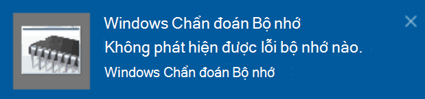

# Chạy Windows chẩn đoán bộ nhớ trong Windows 10

Nếu Windows và các ứng dụng trên máy tính của bạn bị rơi, đóng băng hoặc hành động một cách không ổn định, bạn có thể gặp sự cố với bộ nhớ (RAM) của PC. Bạn có thể chạy các chẩn đoán bộ nhớ Windows để kiểm tra các vấn đề với RAM của máy tính.

Trong hộp tìm kiếm trên thanh tác vụ của bạn, hãy nhập **chẩn đoán bộ nhớ**, sau đó chọn **chẩn đoán bộ nhớ Windows**. 

Để chạy chẩn đoán, máy tính cần khởi động lại. Bạn có tùy chọn để khởi động lại ngay lập tức (Hãy lưu công việc của bạn và đóng tài liệu mở và e-mail đầu tiên), hoặc lịch trình chẩn đoán để chạy tự động trong lần tiếp theo máy tính khởi động lại:

Khi máy tính khởi động lại, **công cụ chẩn đoán bộ nhớ của Windows** sẽ tự chạy. Trạng thái và tiến trình sẽ được hiển thị khi chạy chẩn đoán và bạn có tùy chọn hủy chẩn đoán bằng việc nhấn phím **esc** trên bàn phím.

Khi chẩn đoán hoàn tất, Windows sẽ bắt đầu bình thường.
Ngay sau khi khởi động lại, khi máy tính để bàn xuất hiện, một thông báo sẽ xuất hiện (bên cạnh biểu tượng **Trung tâm hành động** trên thanh tác vụ), để cho biết bất kỳ lỗi bộ nhớ nào được tìm thấy. Ví dụ:

Dưới đây là biểu tượng Action Center:  

Và một thông báo mẫu: 

Nếu bạn bỏ qua thông báo, bạn có thể chọn biểu tượng **Trung tâm hành động** trên thanh tác vụ để hiển thị **Trung tâm hành động** và xem danh sách thông báo có thể cuộn.

Để xem lại thông tin chi tiết, hãy nhập **sự kiện** vào hộp tìm kiếm trên thanh tác vụ của bạn, sau đó chọn trình chuyển đổi **sự kiện**. Trong ngăn bên trái của **trình xem sự kiện**, điều hướng đến **nhật ký Windows > hệ thống**. Trong ngăn bên phải, quét danh sách trong khi nhìn vào cột **nguồn** , cho đến khi bạn thấy sự kiện với nguồn giá trị **memorydiagnostics-kết quả**. Làm nổi bật mỗi sự kiện như vậy và xem thông tin kết quả trong hộp dưới tab **chung** bên dưới danh sách.
