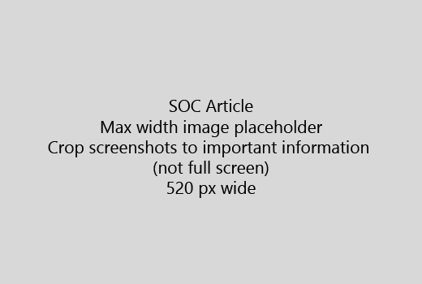

Bắt đầu bài viết của bạn với một giới thiệu rất ngắn (1 câu). Đặt mình vào vị trí của người đọc - tại sao họ đang ở đây? Họ nên làm gì? 
  
1. Đi thẳng đến một danh sách nhanh chóng của các bước để thực hiện nhiệm vụ
    
    Nếu bạn cần phải giải thích một khái niệm, hoặc họ phải làm các bước cần thiết trước, thêm một bản tóm tắt nhanh chóng dưới đây các bước mà họ cần nó, và [liên kết](https://support.office.com/article/f37e7984-cf03-4fde-92d3-82970d7e241b.aspx) đến các khái niệm hoặc các bước. 
    
2. Giữ thủ tục ngắn - bước tốt nhất là 5 hoặc ít hơn, không nhiều hơn 8.
    
3. Sử dụng **giao diện người dùng kiểu** cho các yếu tố giao diện người dùng hoặc văn bản người dân cần phải nhập. 
    
4. Sử dụng các động từ lựa chọn, chọn, hoặc nhập như là hành động và định dạng menu như **Menu** \> **chỉ huy**.
    
5. Thêm tùy chọn, một ảnh chụp màn hình cho bối cảnh (nếu giao diện người dùng rất khó để xác định vị trí, hoặc nó cần thiết để hoàn thành nhiệm vụ).
    
    Chiều rộng tối đa: 520 pixel. Sử dụng một chủ đề tiêu chuẩn, không hiển thị bất kỳ thông tin cá nhân và cây trồng để hiển thị chỉ những gì là có liên quan. 
    
    
  
Nếu bạn muốn thêm một video hoặc ảnh chụp màn hình, sử dụng hai cột lưới và có các bước ở phía bên trái và video hoặc ảnh chụp màn hình ở bên phải - xem [bước và mạng lưới video ví dụ](https://support.office.com/article/14ce8e82-efa0-47f5-bb84-94f078db3dae.aspx). 
  
Nhắm mục tiêu hơn 500 từ cho một bài viết.
  
# Ví dụ bài viết

[Thay đổi hình ảnh của tôi](https://support.office.com/article/555376e0-1fca-49ba-8434-307a0525c767.aspx)
  

