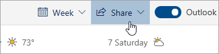

# Chia sẻ với Outlook trên web

Từ lịch của bạn, trên thanh công cụ ở đầu trang, chọn **chia sẻ**và chọn lịch bạn muốn chia sẻ.

    

**Lưu ý**: bạn không thể chia sẻ lịch do người khác sở hữu.

- Nhập tên hoặc địa chỉ email của người mà bạn muốn chia sẻ lịch của mình.
- Chọn cách bạn muốn người đó sử dụng lịch của bạn:
    - **Có thể xem khi tôi đang bận rộn**   cho phép họ thấy khi bạn đang bận nhưng không bao gồm các chi tiết như vị trí sự kiện.
    - **Có thể xem tiêu đề và vị trí**   cho phép họ nhìn thấy khi bạn đang bận rộn, cũng như tiêu đề và vị trí của các sự kiện.
    - **Có thể xem tất cả chi tiết**   cho phép họ xem tất cả các chi tiết của các sự kiện của bạn.
    - **Có thể chỉnh sửa**   cho phép họ chỉnh sửa lịch của bạn.
    - **Đại biểu**   cho phép họ chỉnh sửa lịch của bạn và chia sẻ với người khác.
- Chọn **chia sẻ**.
