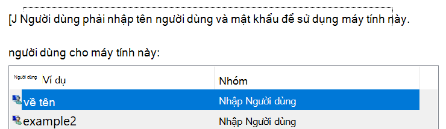

# Đăng nhập vào Windows 10 mà không cần dùng mật khẩuSign-in to Windows 10 without using a password

Để tránh việc nhập mật khẩu tại khởi động Windows, chúng tôi khuyên bạn nên sử dụng một trong các tùy chọn đăng nhập bảo mật của Windows hello, chẳng hạn như mã PIN, nhận diện khuôn mặt hoặc dấu vân tay, nếu có.To avoid having to type a password at Windows startup, we recommend you use one of the Windows Hello secure sign-in options, like a PIN, face recognition, or fingerprint, if available. Nếu bạn thực sự muốn tắt tính năng đăng nhập bảo mật, hãy xem hướng dẫn "tự động đăng nhập vào Windows 10" bên dưới.If you really want to disable secure sign-in, see the "Automatically sign in to Windows 10" instructions below.

**Bảo mật cho các lựa chọn thay thế Windows hello vào mật khẩu tài khoản****Secure Windows Hello alternatives to the account password**

Đi đến **cài đặt > tài khoản > các tùy chọn đăng nhập** (hoặc bấm vào [đây](ms-settings:signinoptions?activationSource=GetHelp)).Go to **Settings  > Accounts > Sign-in options** (or click [here](ms-settings:signinoptions?activationSource=GetHelp)). Các tùy chọn đăng nhập sẵn dùng sẽ được liệt kê.Available sign-in options will be listed. Ví dụ:For example:

Bấm hoặc gõ nhẹ vào một trong các tùy chọn để cấu hình.Click or tap one of the options to configure it. Lần sau khi bạn khởi động hoặc mở khóa Windows, bạn sẽ có thể sử dụng tùy chọn mới thay vì mật khẩu.Next time you start or unlock Windows, you will be able to use the new option instead of a password. 

**Đăng nhập tự động vào Windows 10****Automatically sign-in to Windows 10**

**Lưu ý**: việc đăng nhập tự động thuận tiện, nhưng giới thiệu một rủi ro bảo mật, đặc biệt là nếu PC của bạn có thể truy nhập được nhiều người.**Note**: Automatic sign-in is convenient, but introduces a security risk, especially if your PC is accessible by multiple people. 

1. Bấm hoặc gõ nhẹ vào nút **bắt đầu** trong thanh tác vụ.Click or tap the **Start** button in the Taskbar.

2. Nhập **netplwiz** và nhấn phím Enter để mở cửa sổ tài khoản người dùng.Type **netplwiz** and hit the Enter key to open the User Accounts window.

3. Trong **tài khoản người dùng**, hãy bấm vào tài khoản mà bạn muốn tự động đăng nhập vào khi Windows khởi động.In **User Accounts**, click the account you want to automatically sign in to when Windows starts.

4. Bỏ chọn hộp kiểm "người dùng phải nhập tên người dùng và mật khẩu để dùng hộp kiểm" máy tính này.Uncheck the "Users must enter a user name and password to use this computer" checkbox.

    

5. Bấm **OK**.Click **OK**. Bạn sẽ được yêu cầu nhập và xác nhận mật khẩu cho tài khoản mà bạn đã chọn.You will be asked to enter and confirm the password for the account you selected. Bấm vào **OK** để kết thúc.Click **OK** to finish. Thời gian tiếp theo, Windows 10 bắt đầu, nó sẽ tự động đăng nhập vào tài khoản mà bạn đã chọn.Next time Windows 10 starts, it will automatically sign in to the account you selected.
