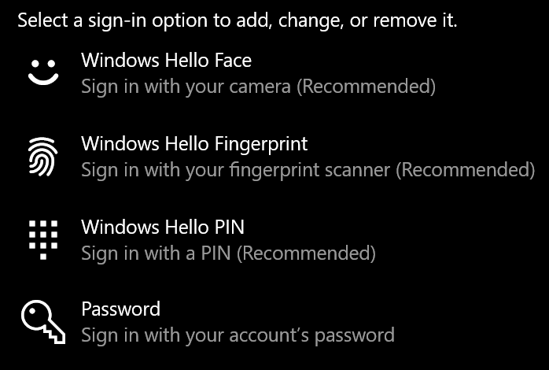
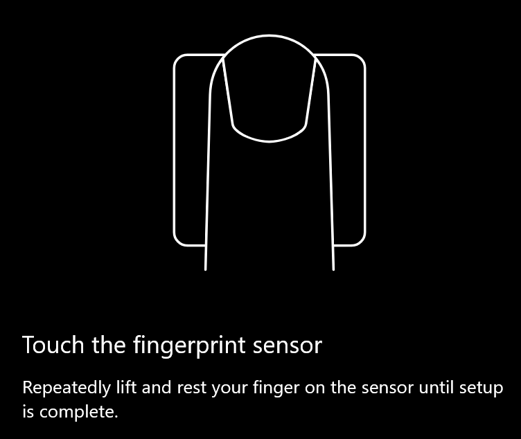
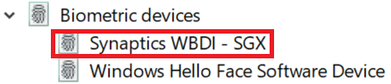

# Sử dụng tùy chọn mở khóa dấu vân tay trong Windows 10

**Bật dấu vân tay của Windows Xin chào**

Để mở khóa Windows 10 bằng dấu vân tay của bạn, bạn cần phải thiết lập Windows Hello dấu vân tay bằng cách thêm (cho phép Windows tìm hiểu để nhận dạng) ít nhất một ngón tay. 

1. Đi đến **cài đặt > tài khoản > các tùy chọn đăng nhập** (hoặc bấm vào [đây](ms-settings:signinoptions?activationSource=GetHelp)). Các tùy chọn đăng nhập sẵn dùng sẽ được liệt kê. Ví dụ:

    

2. Bấm hoặc nhấn vào dấu **vân tay của Windows Hello**, sau đó bấm **thiết lập**. Trong cửa sổ thiết lập Hello của Windows, bấm **bắt đầu**. Cảm biến dấu vân tay sẽ kích hoạt và bạn sẽ được yêu cầu đặt ngón tay của bạn trên bộ cảm biến:

   

3. Làm theo các hướng dẫn, mà sẽ yêu cầu bạn liên tục quét ngón tay của bạn. Khi hoàn tất, bạn sẽ có tùy chọn thêm các ngón tay khác mà bạn có thể muốn sử dụng để đăng nhập. Lần sau khi bạn đăng nhập vào Windows 10, bạn sẽ có tùy chọn sử dụng dấu vân tay để làm như vậy.

**Dấu vân tay của Windows Xin chào không sẵn dùng như một tùy chọn đăng nhập**

Nếu Windows Xin chào dấu vân tay không được hiển thị như là một tùy chọn trong **tùy chọn đăng nhập**, nó nghĩa là Windows không biết về bất kỳ bộ đọc dấu vân tay/máy quét nào được đính kèm với PC của bạn hoặc chính sách hệ thống sẽ ngăn không cho sử dụng của bạn (nếu ví dụ máy tính của bạn được quản lý bởi nơi làm việc của bạn). Để khắc phục sự cố: 

1. Chọn nút **bắt đầu** trong thanh tác vụ và tìm kiếm **trình quản lý thiết bị**.

2. Bấm hoặc gõ nhẹ để mở **trình quản lý thiết bị**.

3. Trong trình quản lý thiết bị, hãy bung rộng thiết bị sinh trắc học bằng cách bấm vào Chevron của nó.

   

4. Máy quét dấu vân tay của bạn sẽ được liệt kê dưới dạng thiết bị sinh trắc học, chẳng hạn như máy quét máy tính Synapdi WBTICS:

   

5. Nếu máy quét dấu vân tay của bạn không được hiển thị và máy quét được tích hợp vào PC của bạn, hãy đi đến trang web của nhà sản xuất PC. Trong phần hỗ trợ kỹ thuật cho mô hình PC của bạn, hãy tìm kiếm một trình điều khiển Windows 10 cho một máy quét mà bạn có thể cài đặt.

6. Nếu máy quét tách riêng ra khỏi PC (được đính kèm qua USB), hãy đi đến trang web của nhà sản xuất máy quét để tìm và cài đặt phần mềm trình điều khiển thiết bị chạy Windows 10 cho mô hình máy quét mà bạn có.
