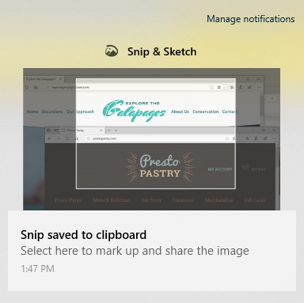

# Sử dụng Chấm & phác thảo để chụp, đánh dấu và chia sẻ hình ảnh

Phác thảo màn hình giờ đây **được gọi là & Phác thảo**. **Để nhanh chóng ng xem một ngiết:**

1. Nhấn phím **Windows logo + Shift + S.** Bạn sẽ thấy màn hình của bạn đậm hơn và con trỏ của bạn được hiển thị dưới dạng chữ thập. 

2. Chọn một điểm ở cạnh vùng bạn muốn sao chép và bấm chuột trái vào con trỏ. 

3. Di chuyển con trỏ của bạn để tô sáng khu vực bạn muốn chụp. Khu vực bạn chụp sẽ xuất hiện trên màn hình của bạn.

   

Hình ảnh bạn đã cắt sẽ được lưu vào bảng tạm, sẵn sàng để dán vào email hoặc tài liệu. 

**Nếu bạn muốn sửa hoặc xem hình ảnh:** 

- Bấm vào biểu tượng thông báo ở phía xa bên phải của thanh tác vụ; sau đó bấm vào ảnh mà bạn vừa chụp. Mẹo của bạn sẽ mở ra trong ứng dụng & phác thảo.

   
