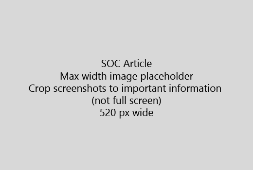

Bắt đầu bài viết của bạn với một giới thiệu rất ngắn (1 câu). Đặt mình vào vị trí của người đọc - tại sao họ đang ở đây? Họ nên làm gì?Start your article with a very short introduction (1 sentence). Put yourself in the reader's place - why are they here? What should they do? 
  
1. Đi thẳng đến một danh sách nhanh chóng của các bước để thực hiện nhiệm vụGet straight to a quick list of steps to accomplish the task.
    
    Nếu bạn cần phải giải thích một khái niệm, hoặc họ phải làm các bước cần thiết trước, thêm một bản tóm tắt nhanh chóng dưới đây các bước mà họ cần nó, và [liên kết](https://support.office.com/article/f37e7984-cf03-4fde-92d3-82970d7e241b.aspx) đến các khái niệm hoặc các bước.If you need to explain a concept, or they have to do pre-requisite steps, add a quick summary below the step where they need it, and [link](https://support.office.com/article/f37e7984-cf03-4fde-92d3-82970d7e241b.aspx) to the concept or steps. 
    
2. Giữ thủ tục ngắn - bước tốt nhất là 5 hoặc ít hơn, không nhiều hơn 8.Keep procedures short - preferably 5 or fewer steps, no more than 8.
    
3. Sử dụng **giao diện người dùng kiểu** cho các yếu tố giao diện người dùng hoặc văn bản người dân cần phải nhập.Use **Ui style** for user interface elements or for text people need to enter. 
    
4. Sử dụng các động từ lựa chọn, chọn, hoặc nhập như là hành động và định dạng menu như **Menu** \> **chỉ huy**.Use the verbs choose, select, or enter as actions, and format menus as **Menu** \> **Command**.
    
5. Thêm tùy chọn, một ảnh chụp màn hình cho bối cảnh (nếu giao diện người dùng rất khó để xác định vị trí, hoặc nó cần thiết để hoàn thành nhiệm vụ).Optionally, add a screenshot for context (if UI is hard to locate, or it's needed to complete the task).
    
    Chiều rộng tối đa: 520 pixel. Sử dụng một chủ đề tiêu chuẩn, không hiển thị bất kỳ thông tin cá nhân và cây trồng để hiển thị chỉ những gì là có liên quan.Maximum width: 520 pixels. Use a standard theme, do not show any personal information, and crop to show only what's relevant. 
    
    
  
Nếu bạn muốn thêm một video hoặc ảnh chụp màn hình, sử dụng hai cột lưới và có các bước ở phía bên trái và video hoặc ảnh chụp màn hình ở bên phải - xem [bước và mạng lưới video ví dụ](https://support.office.com/article/14ce8e82-efa0-47f5-bb84-94f078db3dae.aspx).If you want to add a video or screenshot, use a two-column grid and have the steps in the left and the video or screenshot in the right - see [Steps and video grid example](https://support.office.com/article/14ce8e82-efa0-47f5-bb84-94f078db3dae.aspx). 
  
Nhắm mục tiêu hơn 500 từ cho một bài viết.Target no more than 500 words for an article.
  
# Ví dụ bài viếtExample article

[Thay đổi hình ảnh của tôiChange my photo](https://support.office.com/article/555376e0-1fca-49ba-8434-307a0525c767.aspx)
  

