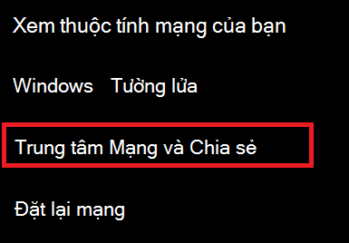
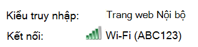
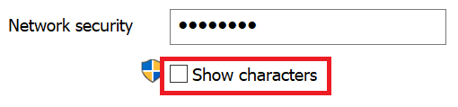

# Xem mật khẩu mạng Wi-Fi trong Windows 10

1. Hãy đảm bảo PC chạy Windows 10 của bạn được kết nối với mạng Wi-Fi.

2. Đi đến **thiết đặt > mạng & Internet > trạng thái**, hoặc bấm hoặc gõ nhẹ vào [đây](ms-settings:network?activationSource=GetHelp) để cho phép chúng tôi đưa bạn đến đó ngay bây giờ.)

3. Bấm vào **Trung tâm mạng và chia sẻ**.

    

4. Trong **Trung tâm mạng và chia sẻ**, bên cạnh **kết nối**, bạn sẽ thấy tên mạng không dây của bạn. Ví dụ, nếu mạng của bạn có tên là "ABC123", bạn có thể thấy:

    

    Bấm vào tên mạng không dây để mở cửa sổ trạng thái Wi-Fi. 

5. Trong cửa sổ trạng thái Wi-Fi, hãy bấm vào các **thuộc tính không dây**, bấm tab **bảo mật** , rồi chọn **Hiển thị các ký tự**.

    

